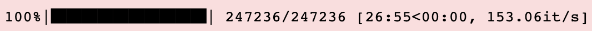
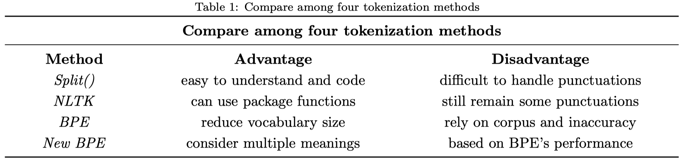
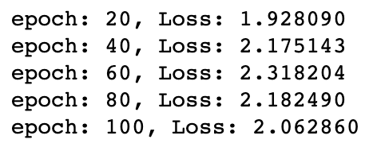
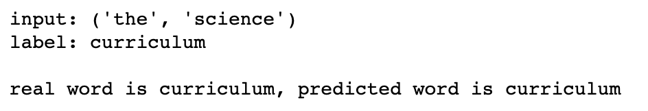
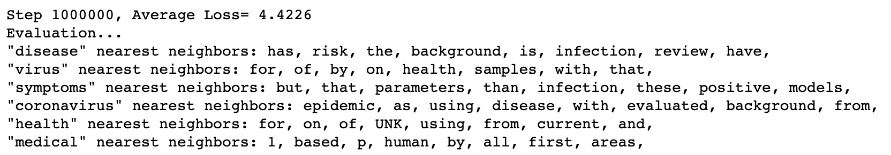
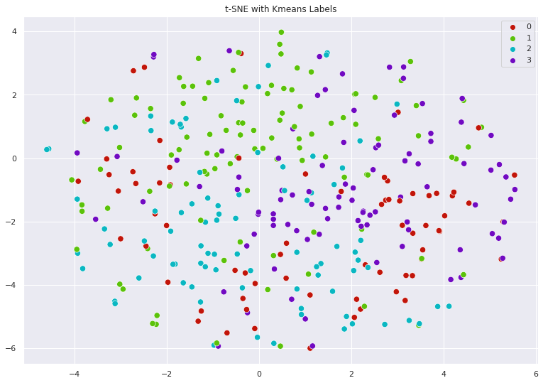
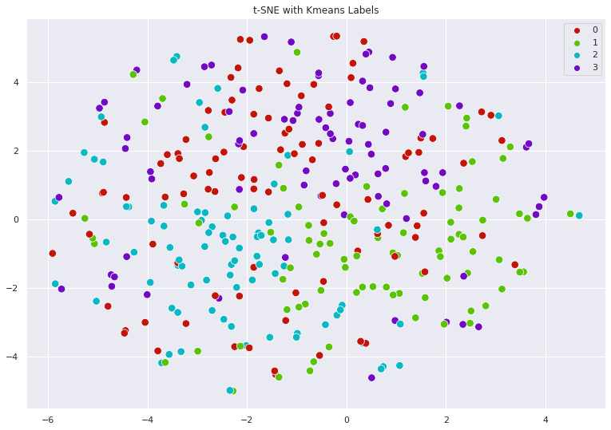
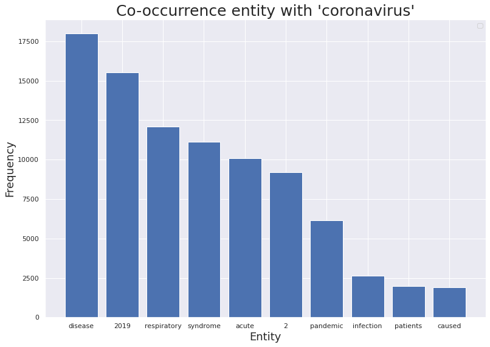
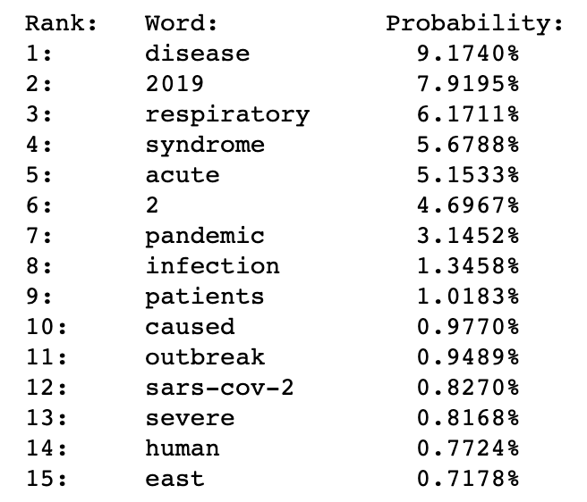
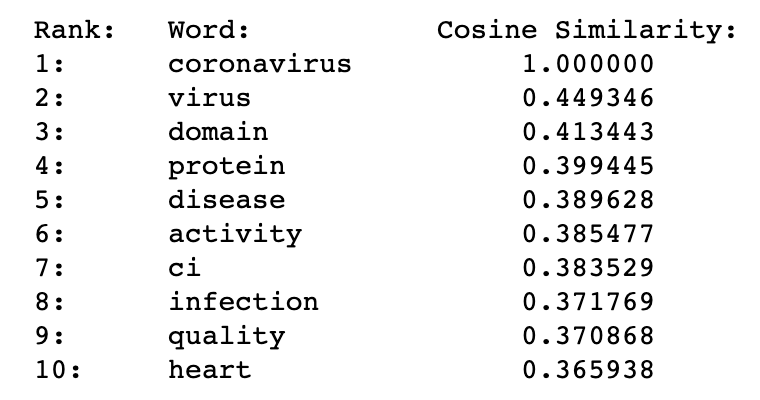

# Word Representation in the Biomedical Domain

Final Project - Data Science Summer School @Imperial College London

## Table of Contents

- [Abstract](#Abstract)
- [Introduction](#Introduction)
- [Methodology](#Methodology)
- [Results and Analysis](#results-and-analysis)
- [Discussion](#Discussion)
- [Conclusion](#Conclusion)
- [References](#References)

## Abstract

Nowadays, despite the overwhelming number of scientific articles in the field of natural language processing (NLP), there still exists an urgent call for developing more effective language modeling for a wide range of biomedical tasks that target tac applying NLP methods. In this field, high-quality and meaningful biomedical words enable doctors to quickly obtain the gist of information and knowledge to make quicker clinical decisions. In this report, we have been through four significant parts, training distinct tackling models confronting related NLP problems in the biomedical domain. The first part is to parse relevant biomedical articles from the 247236 JSON files, and the second part is to do word tokenization with the standard split method, NLTK, and BPE applied to segment the text. The next part concerns word representations, where the tokenization results are further processed. Three commonly used word embedding models, N-gram, Skip-gram, and MLM(masked language model), are trained in this part in sequence to capture beneficial semantic properties and linguistic relationships between words, obtaining word representations. Finally, we will explore based on the phrase representation results in the last part, where t-SNE and K-means are introduced to reduce the vector dimension and conduct clustering correspondingly. After all, the Medterms medical dictionary and Stopwords list are referred to in an attempt to select biomedical entities and find frequent co-occurrence words with the word ‘coronavirus’ and biomedical entities with the closest semantic similarity.

**Keywords**: NLP; Biomedical; NLTK; BPE; N-gram; Skip-gram; MLM; T-SNE

## Introduction

The application of Natural Language Processing (NLP), a significant explorable and valuable subfield of linguistic and artificial intelligence dealing with gigantic natural language data, plays an increasingly important role in various areas, including biomedical research. Typically, clinical medical information is stored in the system as unstructured (or semi-structured) text. At the same time, NLP can be a critical technology for extracting useful information from complex medical texts by transforming the data into structured models. Thus, we can realize word representation in the biomedical domain using NLP.

According to the given instructions, to develop appliable algorithms, it is suggested that we follow the steps of parsing the data, tokenization, building word representations, exploring word representations, and finally, mining biomedical knowledge.

From the papers we looked through concerning biomedical word representations, semantic resources could be utilized in the initial tokenization and building process after importing the data. As is demonstrated in Distributional Semantics Resources for Biomedical Text Processing$^{[1]}$, S Moen and others show a way to build a dataset for BioNLP. Specifically, when extracted from biomedical articles, the text is processed, preserving only the title, abstract, and main body; Unicode characters are transformed to ASCII; the whole text is partitioned into single sentences and tokenized. Next, data from 1-gram to 5-gram are collected. Then, the word vectors are built. Moreover, Word2vec (Mikolov et al., 2013) could be used to calculate vector representations and to induce word clusters. Finally, the outcome is assessed using extrinsic evaluation means. Aside from applying semantic resources, distributed phrase representation is also considered for text processing. PMCVec, a model proposed by Zelalem Gero et al.$^{[2]}$​ Can generate effective phrases from the corpus and build a distributed representation that contains single and multi-word phrases by treating both as a specific unit using an unsupervised method. By establishing the model, valuable phrases could be generated from the corpus, and a new criterion can be introduced to rank the generated phrases to avoid incorporating all the phrases and achieve a better embedding for both single and multi-word phrases. (However, they could not train different models in large and window sizes and only compared them in smaller dimensions.)

As for further building and exploring word representations, clinical abbreviation disambiguation could be introduced to improve the algorithm. The challenge of handling abbreviations widely used in clinical notes is never neglectable, so a word embedding method is tailored to the medical domain (Yonghui Wu et al., 2015) based on hospital and Health Service datasets. According to the SBE feature (Li et al.,2014), its variation LR\_SBE and MAX\_SBE are generated to better describe word semantics.$^{[3]}$​ Nevertheless, the dataset only focuses on abbreviations with enough samples to train; the window size is limited, so some semantically meaningful words might be missed.

Another topic universally referred to when refining the models is word-bedding. Di Zhao et al. suggest a local linear embedding framework based on manifold learning to solve the problem of distributed word representation, ignoring the influence of the word embedding geometric structure obtained through calculating the word semantic information.$^{[4]}$ The method theoretically founded in the metric recovery paradigm is proven to improve the accuracy of classifications and similarities. Word-bedding is also worth working on because it encourages future studies to undertake the model in two meaningful directions. It reduces the computational requirements and explores the impact on the model performance of using vocabulary built on the specific pre-trained corpus.

We have also noticed a pre-trained language representation model dealing with relevant NLP problems. When applying the progress of NLP technology directly to biomedical text mining, transferring vocabulary future studies to undertake the model in two meaningful directions, both reducing the computational requirements and exploring the impact on the model performance of using vocabulary built on specific pre-distribution from general domain corpus to the biomedical corpus is always unavoidable. Jinhyuk Lee et al. thus propose the BioBERT model, which is pre-trained on large-scale biomedical corpora.$^{[5]}$ The new model performs better than the previous BERT model in biomedical named entity recognition, biomedical relation extraction, and biomedical question answering. Moreover, scholars focus on designing models using more efficient architectures to reduce computing costs. Thus, Giacomo Miolo et al. propose a pre-trained domain-specific model called ELECTRAMed, which takes advantage of the computing of the ELECTRA model and is specifically suitable in the biomedical field.$^{[6]}$ The results show that ELECTRAMed obtains valuable results for everyday NLP tasks in the biomedical field and efficiently uses ELECTRA's architecture in the pre-training stage.

To develop feasible algorithms for word representations, semantic resources and distributed phrase representations are ideal references for the tokenization and establishing stage. At the same time, clinical abbreviation disambiguation and word-bedding are expected to be introduced when further building and exploring the model, and above all, a pre-trained language representation model could be taken into consideration in an attempt to solve some commonly related NLP problems.

## Methodology

### Parse the data

Before designing the algorithm, we need to scan all the JSON files and extract texts from the relevant fields, including titles, abstracts, and body text. The variable $ all\_json $ is a list to store the path of all JSON files from the given folders. Then, in the class $ FileReader $ We extract the parts we want from the file and put them on the list. For example, if we're going to get the first file in the given file list, we can use $ FileReader(all\_json[0]) $ Then, we can get all the three parts desired. And $ FileReader(all\_json[0]).abstract $ can return the abstract of the first file in the list. Applying the methods above, we can get the sting type of the content in JSON files.

### Tokenization

Tokenization is essential in natural language processing, traversing the extracted text and segmenting the text into words(tokens). However, splitting a text into smaller chunks is a task that is harder than it looks due to different rule-based tokenization methods. In this report, we applied three different approaches to realize this algorithm —— the standard **split** method in Python, **NLTK**, and **Byte-Pair Encoding(BPE)**.

#### Standard split() in Python

The simplest method to segment the text into single words is to use the standard $ split() $ Method by Python. But we not only want to split by and delete the space but also to do segmentations by punctuation. So, if we use $ split() $, we need to write many lines, each consisting of one separator. So, we tend to extend this $ split( $) method: $ re.split() $​ This method can split and delete more than one separator simultaneously.

Firstly, $ row[i $] in "$ rows $= $[FileReader(all\_json[i])$ for $i$ in $ range(len(all\_json))] $"The article we get consists of three parts, as mentioned in part one. Then we use $ row[i].abstract $ and $ row[i].body\_text $ to get the contents in each article, which is String type. Then, $ re.split('[\backslash s;,.:()]\backslash s*',abs) $​ It is used to tokenize the abstract or body text by space and punctuation. This can generate a list consisting of the words in the text.

#### NLTK

However, space and punctuation could be more satisfying. For example, sometimes we don’t want to delete the " ‘ " between some particular words like "o'clock," so we seek other methods. There are many methods by NLTK. In this report, we choose $ word\_tokenize $ in $ nltk $, which split every word and punctuation in the passages to conduct tokenization. We first use $  nltk.word\_tokenize $ segment the text based on the established rules, which remain the same for all punctuation. Then, we use a for loop to delete all separators besides letters and numbers. The method $ isalnum() $​ It is contained in the loop. Finally, we transform all the uppercase letters into lowercase letters.

#### BPE

BPE relies on a pre-tokenizer that splits the training data into words. We put all the text into a list called "files." We use the NLTK method above to get the segmented words. After pre-tokenization, a set of unique words was created, and the frequency of each word in the training data was counted. We use a dictionary called "vocab" to realize this(key is the word, and value is the frequency at which it occurs). Its form looks like this: $ vocab $ = \{ 'l o w ': 5, 'l o w e r ': 2, 'n e w e s t ':6, 'w i d e s t ':3 \}. Next, BPE creates a base vocabulary consisting of all letters in the set of unique words and learns to merge rules to form a new symbol combined with two symbols of the base vocabulary. It does so until the vocabulary has attained the desired vocabulary size. After this, we put the keys in the dictionary into a new list called "keys." But each element looks like this: "Tay lor," "accordingly." So we use  an "output" list; in this way, the output may not be every single word but some familiar symbol pair that is part of the word, like "ing" or "ly."New BPE

In 2.2.3, a BPE model is built to realize tokenization by creating a vocabulary base presenting every letter in one unique word and forming new symbols. Still, this method needs to be specially designed for the biomedical domain. A new BPE model is introduced in this track to better the algorithms. Words are additionally filtered so that only terms of the biomedical domain would be put out into the list.

Deciding on the biomedical words to build the new BPE is necessary. *MedicineNet* offers an ideal list of all biomedical terms that could be used to distinguish oriented words. Therefore, all that needs to be done is to add a conditional statement telling apart whether the processed words belong to the biomedical domain based on the list of terms collected from *MedicineNet*.

### Word representation

Distributed word representation, usually obtained through calculation from large corpora, has been widely used in text because of its effectiveness in representing word semantic information. This part mainly contains two models: **N-gram** and **Skip-gram**. The former uses the 'n' number of previous background words to predict the next word, while the latter uses the central word to indicate the background words. Besides, a **Masked Language Model(MLM)** contextualizes word representations considering different conditions.

#### N-gram

N-gram Language Modeling is to predict a target word by using n words from the previous context. If expressed in conditional probability, it can be written as $ P(W{i} | W_{i-1}, W_{i-2},$ …$, W_{i-n+1}) $.

We first establish a training set and traverse the whole $ test\_sentence $Separating them into three groups of words, the first two as input and the last as the result of prediction. Then, encode each word and use numbers to represent the word. Only in this way can we pass in $ nn.embedding $ to get the word vector.

Now, we can build the N-gram model. We pass in three parameters: the total number of words, the number of words on which the predicted word depends, and the dimension. We use the tokenization results from 100 papers, set.'$n = 2$​iterate 100 times, input the word and label, and transport forward and backward to train the model.

Lastly, we can get the predicted word as output and representation.

#### Skip-gram

In skip-gram, we use a central word to predict its context. If expressed in conditional probability, its $ P(W_{c-m},$ …$, W_{c-1}, W_{x+1}, …, W_{c+m}|W_{c}) $. First of all, we set the training parameters as: \{$learning\_rate = 0.05$, $batch\_size = 128$, $total\_steps = 1000000$, $display\_step = 10000$, $evaluation\_step = 100000$\}.

Then, we set the evaluation parameters using five words: "disease," "virus," "symptoms," "coronavirus," "health," and "medical." Next, we set the Word2Vec Parameters to be: "$count = [('UNK', -1)]$" to replace rare words with UNK tokens. $min\_occurrence = 1000$ to retrieve the most 1000 words which have the most considerable occurrence frequency, and remove samples with less than $ min\_occurrence $, in this report, we set it as 10. "$ word2id $" is a dictionary that assigns an id to each word. Finally, we can generate a training batch for the skip-gram model. "$ skip\_window = 3 $" indicates the number of words to consider left and right, so the window size "span" is "$ 2\times skip\_window + 1 $". "embedding" is the embedding variable; each row represents a word embedding vector. The number of negative sampling to sample is defined as 64.

The cosine similarity between input data embedding and every embedding vector is evaluated during the model training. Then, the algorithm will output the background word nearest to the central word.

#### MLM

A defection of our model is that the above two methods do not include conditions to contextualize word representations, so the results may seem strange without contexts. For example, the word representation of "stick" is fixed regardless of context under N-gram language modeling and word2vec. However, the representation of "stick" is shown dynamically based on context using MLM. The Masked Language Model, which BERT proposed, could be introduced to refine the model and contextualize the word representations in the pre-training stage. 

MLM model is easy to set up based on related references, and repeating a similar training process realized in N-gram language modeling and word2vec could help get the model running. To present the outcome, corresponding contexts are listed beside the word representations, describing the results' conditions.

### Explore the word representation

#### The word representations by t-SNE

In this part, we need to visualize high-dimensional vectors and choose the t-SNE algorithm to realize this. T-SNE is a dimension reduction algorithm that transforms high-dimensional vectors into 2-dimension. We choose the first 1000 high-frequency words acquired in the Skip-gram model, excluding the stopwords. After reducing the dimension, we use K-means to cluster the words. We classify the words into six parts, which can be visualized. Then, we can plot the figure.

#### Visualize the Word Representations of Biomedical Entities by t-SNE

In 2.4.1, we focus on all the frequently occurring words, but in this part, we only concentrate on biomedical entities. To get all the professional biomedical words, we read the form $  MedTerms $  medical dictionary, and we tokenize the text we get. To make our word list more accurate, we read the file "stopwords.txt" to delete those $ stopwprds $. Then, we search those biomedical entities in $ word2vec $, also visualize and cluster the words that have occurred in $ word2vec $.

#### Co-occurrence

Then, to present the word that occurs with the word Covid-19, we first count the words that appeared in $ MedTerms $ medical dictionary and sort the frequency. Then, the frequency distribution histogram is drawn to visualize the data. Next, we look for the dictionary again, count the words (3 before and three afterward) around the “coronavirus,” and delete the stopwords in them. %The figure below shows the frequency distribution histogram of the co-occurrence entity with “coronavirus.” 

We count the co-occurrence frequency of the words in the texts that read from the JSON file and put them in the 100 $ \times $​ 100 matrix, which is then standardized for calculating the conditional probability. Last, after deleting stopwords, we print out the first 20 high-frequency biomedical words and their conditional probabilities.

#### Semantic similarity

This part is to find the words that have semantic similarities with "coronavirus," like "Covid-19". Calculating the cosine similarity with "coronavirus" can generate the output. The method used here is $ cosine\_similarity() $.

## Results and Analysis

 Several papers are 247236, while about 172068 papers whose abstracts are papers(the total considering the computation ability of the CPU and the max RAM, we load 100 papers' abstracts to conduct the latter n-gram and load the abstract of all number of documents is 247236 while about 172068 papers whose abstracts are papers(the total not empty). The loading process of all documents is shown as follows.

### Tokenization

The advantages and disadvantages of the four tokenization methods are shown in Table 1. Comparing these methods, we finally chose the result of NLTK and passed it on to the next part.

### Word representation

Here, we compare the training results from the N-gram and Skip-gram models. 

The first is N-gram. After 100 epochs of training, the value of the loss function of N-gram remains stable at around 2.0, which satisfies the standard of an effective training result. Primarily, we randomly choose \{'the,' 'science'} at position [733] to test the result, and the predicted word is shown to be 'curriculum,' which is identical to the accurate word behind these two words.

Here comes the Skip-gram. After the total learning steps of 1000000, the value of the loss function of Skip-gram remains stable at around 4.4, a little larger than that of N-gram. The evaluation results of five evaluation parameters are shown below. Take 'coronavirus' for instance; its nearest eight neighbors are 'epidemic,' 'as,' 'using,' 'disease,' 'with,' with 'evaluated,' 'background,' and 'from.'

Comparing the N-gram and Skip-gram, although the loss function of the N-gram is smaller than that of the Skip-gram, it only uses 100 papers as the material due to the limited computation ability. In comparison, Skip-gram uses all 247236 papers. Besides, the dimension of embeddings of N-gram is ten while that of Skip-gram is 200, 19 times more than N-gram. Consequently, we choose the result from Skip-gram and pass it to the next part.

### Visualization

After deleting the stopwords, 717 words remain in the vocabulary. The visualization result of vocabulary after t-SNE and K-means is shown as follows. Another figure shows the visualization results of biomedical vocabulary after t-SNE and K-means.

### Co-occurrence and semantic similarity

The result shows that the most frequent co-occurrence of biomedical entities with 'coronavirus' is 'disease,' which co-occurs almost 17982 times, with a conditional probability of 9.1740%. The frequencies of the top 10 words are shown in a histogram in the following, and the conditions of the probabilities of the top 15 words are shown in the next figure.

The last figure shows the top 10 words with the most considerable cosine similarities to 'coronavirus.' It illustrates that the word 'virus' has the most considerable cosine similarity(about 0.45). The result is consistent with everyday cognition.

## Discussion

Some parts were conducted well based on the above methodology and our results. Here are some points that we consider to perform well in this project.

- In part 1, we load all the passages given to train the model, so our training result is relatively accurate.
- In part 2, we conduct all the required tokenization methods that perform well. Besides, we successfully built a new BPE model based on the traditional one, which considers biomedial entities.
- In part 3, for both the N-gram and Skipgram, the loss function is controlled in the range between 2 and 4, which is reasonable. Expressly, for skip-gram, we set the total steps to be 1000000, and it begins to remain stable at around 600000 steps with the loss value, indicating that there is a lot more space for training a larger dataset.
- In part 4, we calculate the frequency of the words and present the frequency distribution histogram, which can show the result more directly. Besides, we create a co-occurrence matrix to store every word's frequency of co-occurrence with other words and their conditional probabilities. Moreover, we choose the biomedical words or entities from an authoritative medical dictionary $MedTerms$. We also consider English stopwords and delete them from the final result to make both the tokens and visualization results more effective.

However, there are still some shortcuts in our projects.

For the tokenization part, we chose the most straightforward method in NLTK. However, there are still many other complicated methods that can tokenize the text more accurately and help complete the following task better. However, due to our lack of time, we used the word\_tokenize method. After summer school, if we have time, we will use those better methods to refine our project.

The N-gram model can be predicted with considerable accuracy for the word representation part. However, if we increase the number of passages as input, the run time will be much slower; we tried to improve our algorithm and change the “N,” but the result is still unsatisfactory.

For the visualizing part, the points of the same color could be more exceptionally concentrated but relatively scattered. It may be because the words with similar meanings may have significant form differences, such as prefixes and suffixes. So, their word representation would be different. As a result, after reducing the dimension, the words may not be presented together.

## Conclusion

The current study builds and showcases effective language models dealing with related natural language processing tasks in a particular subfield. Despite some inherent defects in the models, the overall algorithm design meets the need for practitioners in the biomedical domain to obtain core information required in clinical practice as soon as possible. Specifically, data are tokenized using standard split(), NLTK, BPE, and advanced BPE models in sequence and put into word representations through N-gram, skip-gram, and MLM training models separately. Moreover, t-SNE is also run in our system to demonstrate the outcome with co-occurrence and semantic similarity results shown visually and vividly to understand the word data better. Beyond all, further research and development are still needed to extract intelligence from biomedical text corpus better automatically and efficiently.

## References

1. Pyysalo S, Ginter F,  Moen H, et al. Distributional semantics resources for biomedical text processing. 2013.
2. Gero Z, Ho J . PMCVec: Distributed Phrase Representation for Biomedical Text Processing[J]. Journal of Biomedical Informatics X, 2019, 3:100047.
3. Wu Y ,  Xu J ,  Zhang Y , et al. Clinical Abbreviation Disambiguation Using Neural Word Embeddings[C]. Proceedings of BioNLP 15. 2015.
4. Zhao D ,  Wang J ,  Chu Y, et al. Improving Biomedical Word Representation with Locally Linear Embedding[J]. Neurocomputing, 2021.
5. Lee J ,  Yoon W ,  Kim S ,  et al. BioBERT: a pre-trained biomedical language representation model for biomedical text mining[J]. Bioinformatics, 2019.
6. Miolo G, Mantoan G, Orsenigo C. ELECTRAMed: a new pre-trained language representation model for biomedical NLP[J].  2021.
